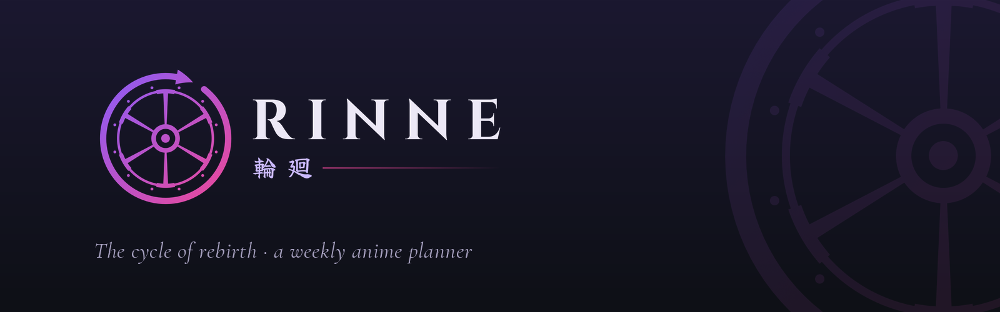
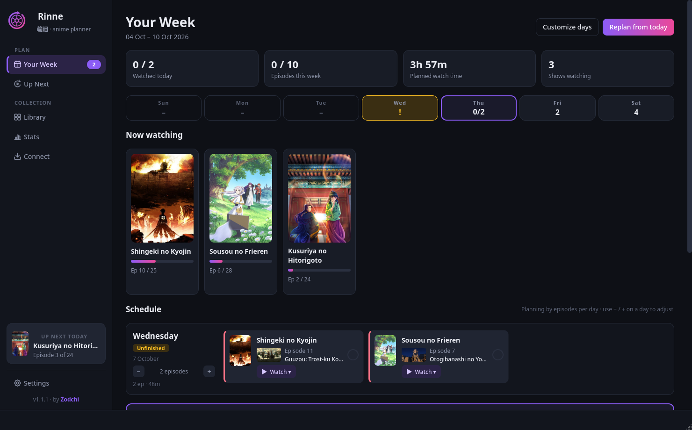
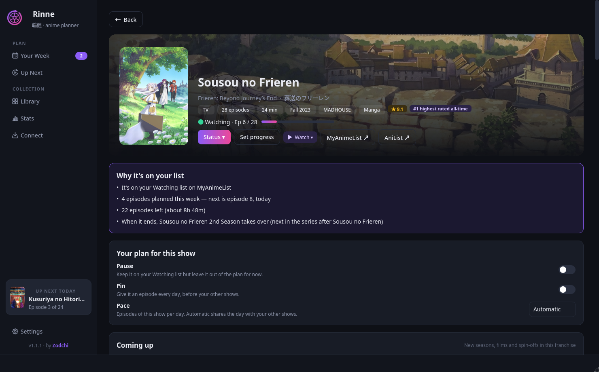
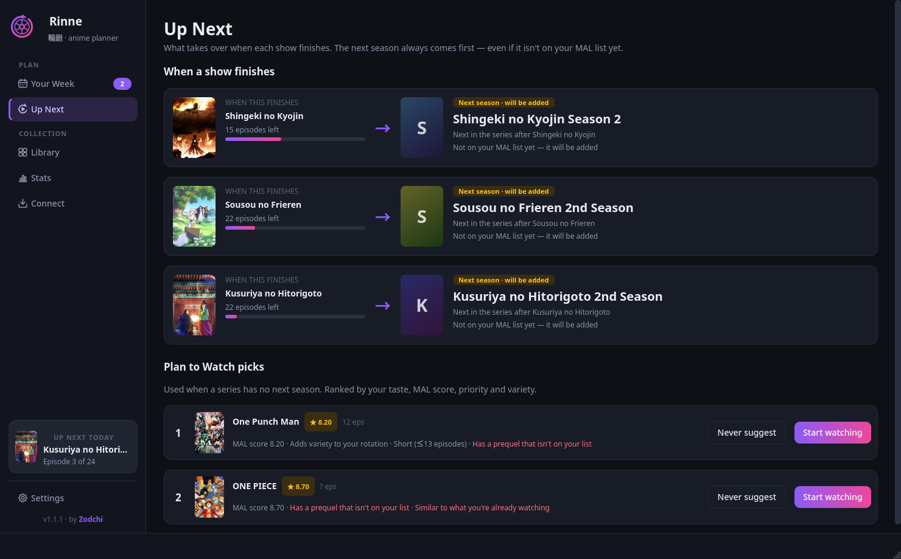
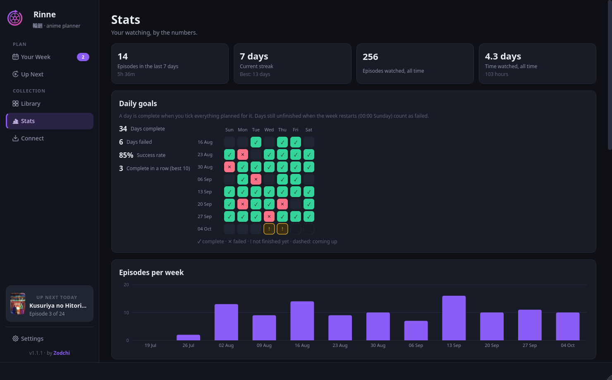
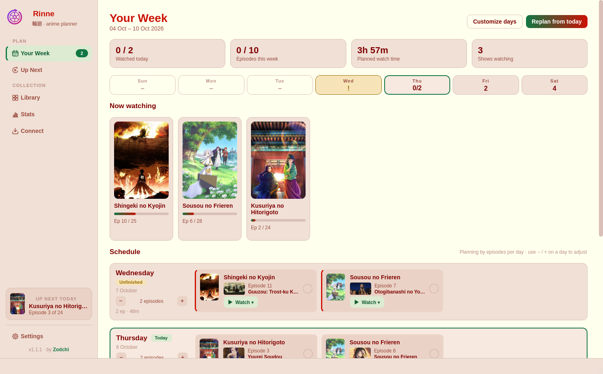

<picture>
  <source media="(prefers-color-scheme: light)" srcset="brand/banner/rinne-readme-banner-light-mode.png">
  
</picture>

<p align="center">A desktop anime planner for Linux and Windows.</p>

Rinne turns your **MyAnimeList** or **AniList** list into a weekly watch plan. When a show ends,
its next season is reborn in its place, even if it isn't on your list yet, and Rinne tells you
why. Tick episodes as you watch and your MAL or AniList account stays up to date.

By **Zodchi** · [MIT License](LICENSE)

<p align="center"></p>

## Features

- **A weekly plan** (Sunday to Saturday) built from the shows you're watching, with episode
  titles and thumbnails. Finish a day's episodes and it's checked off with a little celebration.
- **Weekly goals:** days left unfinished wait until the week restarts (00:00 Sunday), then count
  as failed. Stats keeps your completed and failed days.
- **Follows every series.** A finished show is replaced by its next season. Only when a series
  runs out does Rinne pick from your Plan to Watch, and it explains each choice.
- **You stay in control.** Drag a show to another day, pause or pin a show, set a show's pace,
  and give each weekday its own amount of episodes or minutes.
- **Airing shows** are scheduled as episodes come out, and you catch up if you fall behind.
- **New seasons** of shows you've watched are announced, and can be added automatically.
- **Connect MyAnimeList or AniList:** your list comes in, private entries too, and stays in sync
  both ways: ticked episodes, status changes and scores are sent for you, and changes you make
  there come back to Rinne.
- **English or Russian**, with show titles in Russian too (from Shikimori), and lists importable
  from Shikimori.
- **Show profiles** with synopsis, cast and voice actors, related entries, upcoming seasons and
  where to watch.
- **Stats** and a weekly recap, plus a **calendar file** for Google Calendar, Thunderbird and
  others.
- **Themes** (Midnight, Dark, Light, Yotsuba), a full-HD background slideshow of today's shows,
  and **Discord Rich Presence** with no setup.

| | |
|---|---|
|  |  |
|  |  |

## Install

**Windows:** download `Rinne-Setup-<version>.exe` (installer) or `Rinne-Portable-<version>.exe`
(no install) from the [latest release](https://github.com/ZodchiSama/RINNE/releases/latest).
If Windows says it protected your PC, click **More info → Run anyway**. The build isn't
code-signed yet.

**Linux (AppImage):** download `Rinne-<version>-x86_64.AppImage` from the
[latest release](https://github.com/ZodchiSama/RINNE/releases/latest), then:

```sh
chmod +x Rinne-*-x86_64.AppImage
./Rinne-*-x86_64.AppImage
```

It runs on most distributions from 2022 onwards. Gear Lever or AppImageLauncher can add it to your
app menu and keep it updated.

**From source:**

```sh
git clone https://github.com/ZodchiSama/RINNE.git
cd RINNE
./install.sh          # virtual environment, `rinne` command, icon and app-menu entry
```

Rinne checks GitHub for new versions once a day. When one is out it shows the release notes once,
sends a notification, and keeps an **Update** button in the sidebar (Settings → General). After
updating, a one-time *What's new* window lists the changes, and they stay in Settings → About.

## Getting your list in

On first launch, a welcome screen walks you through connecting your account and setting up your
week. You can replay it, and a short tour, from Settings → General.

- **Connect your account (recommended):** press **Connect** in the sidebar and sign in to
  MyAnimeList or AniList. Rinne brings in your whole list, private entries included, and keeps
  your account up to date from then on.
- **Import by hand:** if you'd rather not connect, use *Don't want to connect?* in the same
  window. You can import a MAL export file (*Profile → Export* on MAL), a MAL username, a
  public AniList username, or a public **Shikimori** nickname. Rinne first lists what you'd miss
  without a connection.
- **Titles in Russian:** pick **Русский** in *Settings → General → Titles*. Russian titles come
  from Shikimori and work for any list, not only Shikimori imports. Shows Shikimori has no
  Russian title for stay in romaji.

Rinne then fills in show details from **AniList**: covers, English, romaji and Japanese titles,
sequel links, episode lengths and exact airing dates. Episode titles and fan art come from
TheTVDB through ani.zip. Everything is cached on disk.

Re-importing is safe: progress you tracked in Rinne is never rolled back by an older list.

## Account sync

Once you're connected (from **Connect** in the sidebar or **Settings → Accounts**), the episodes
you tick, status changes and scores are sent a few seconds later, and only for shows that
changed. Changes you make on MyAnimeList or AniList themselves come back to Rinne on startup and
every few hours, and planned episodes you watched elsewhere are ticked for you. Sign-ins are stored only on your computer. Turn sending off per service at any time,
press **Sync now**, or bring your list in again from the Connect window.

## Using Rinne

- **Your Week:** the week runs Sunday to Saturday, with a strip showing each day at a glance and
  one card per show listing its episodes. Tick an episode when you've watched it (a mis-click
  can be undone from the message that appears). When a day is
  done it folds into a one-line summary (**Show** opens it again). Earlier days you didn't
  finish stay open, marked *Unfinished*. **Drag** a show onto another day to move it, or within
  a day to reorder. Use **−** / **+** to change a day's amount. **Replan from today** (Ctrl R)
  plans the rest of the week again.
- **Click any show** to open its profile. You'll see why it's in your plan, its episodes, cast
  and voice actors, related entries and upcoming seasons, and where to watch it. **Your plan for
  this show** has the per-show controls:
  - **Pause:** keep it on Watching but leave it out of the plan.
  - **Pin:** an episode every day, before your other shows.
  - **Pace:** a fixed number of episodes a day.
- **Up Next:** newly announced seasons, and what takes over each show when it ends.
- **Library:** your whole list as posters. Filter, search, sort, and right-click for quick
  changes.
- **Stats:** your daily goals (days complete and failed, success rate, a grid of recent weeks),
  episodes per week and per day, streaks, top genres and all-time totals.
- **Notifications** (Settings → Notifications): new episodes, a daily reminder, a Saturday
  recap, a heads-up on Saturday evening if days are still unfinished, the start of a new week,
  and new Rinne versions.
- **Calendar:** **Settings → Schedule → Calendar** exports your plan as an `.ics` file, or keeps
  one updated for calendar apps to subscribe to.
- **Zoom** with Ctrl + / Ctrl − or Ctrl + mouse wheel, and **Ctrl 0** resets it.
  **Ctrl 1–4** switch pages and **Ctrl ,** opens Settings.

## How scheduling works

- **Weeks run Sunday to Saturday.** At 00:00 Sunday a new week is planned. Any day of the old
  week with episodes left unticked counts as failed.
- **Only shows on your Watching list are scheduled.** Plan to Watch shows join when one replaces
  a finished show, or when you press *Start watching*.
- Plan by **episodes** or **minutes per day**, set separately for each weekday (0 = day off).
- Episodes are shared out fairly across your shows, with a "max episodes of one show per day" cap.
  Pinned shows go first, and a show's own pace overrides the cap.
- **Airing shows** only get episodes that have aired, using AniList's exact release times. If
  you're behind on an airing show, it gets an extra episode a day until you catch up
  (Settings → Schedule).
- Within a day, shows with the fewest episodes left come first, unless you reordered them.

## What replaces a finished show

When you tick a finale:

1. **Follow the series.** Rinne walks the sequel chain. It skips seasons you've completed and
   resumes one you put On Hold. If the next season isn't on your list, Rinne adds it.
2. The chain stops at a season that hasn't aired yet, one you dropped, or one you're already
   watching. Only then does Rinne pick from **Plan to Watch**, scored by:

| Signal | Effect |
|---|---|
| Same franchise (side story, spin-off…) | +25 |
| Its prequel is still unfinished on your list | −80 (no season 2 before season 1) |
| Genre overlap with the finished show | up to +25 |
| Your taste: your average score in its genres compared with your overall average | ± |
| MAL community score | ±, centred on 7.0 |
| Priority set on MAL | +6 / +15 |
| Genres already covered by your other shows | up to −10 (keeps variety) |
| Long shows (> 50 eps) / short (≤ 13) | small − / + |

A pop-up shows what comes next and why. Automatic replacement can be turned off in Settings, and
*Never suggest this* (right-click in Library) excludes a show.

## Data and privacy

- Your list, plan and settings live in `~/.local/share/rinne/` (Windows: `%APPDATA%\rinne`),
  with a cache in `~/.cache/rinne/` (Windows: `%LOCALAPPDATA%\rinne`).
- Rinne talks only to AniList, MyAnimeList/Jikan, ani.zip, GitHub (update check) and, if it's
  running, your local Discord app. There's no telemetry.
- A log file (`rinne.log` in the data folder) helps with bug reports. **Settings → About** can
  open it, and the feedback form can attach the last lines.

## Translations

Rinne's interface is available in **English** and **Russian** (Settings → General → Interface
language). Show titles can also be shown in Russian, from Shikimori. Each language is a single JSON
file; see [CONTRIBUTING.md](CONTRIBUTING.md#translating-rinne) to add yours.

## Limitations

- Only shows already on your list are picked from Plan to Watch. Unlisted sequels are handled.
- A few obscure entries have no data on AniList or MAL and get a lettered placeholder cover.

## Development

```sh
python3 -m venv .venv && .venv/bin/pip install -e ".[dev]"
.venv/bin/python -m pytest              # logic and interface tests (offscreen, no network)
packaging/linux/build_appimage.sh       # AppImage in dist/
.venv/bin/python tools/brand_assets.py  # rebuild the app's icons and logos from brand/
```

Pushing a `v*` tag builds the Windows installer, the portable exe and the AppImage on GitHub
Actions. See [CONTRIBUTING.md](CONTRIBUTING.md) for the code layout.

## Feedback

Found a bug or have an idea? Use **Settings → About → Send feedback**,
[open an issue](https://github.com/ZodchiSama/RINNE/issues), or email **zodchi.san@proton.me**.

## License

[MIT](LICENSE) © 2026 Zodchi
